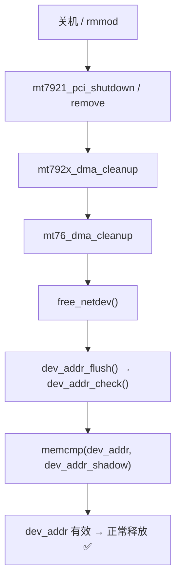

# MT7902 板载无线网卡：从「内核不支持」到稳定可用全记录

> 记录时间：2026-09-21
> 平台：Ubuntu 22.04.5 LTS (jammy) / HWE 内核 6.8.0-138-generic
> 硬件：ASUS B760M-AYW WIFI D4 板载 MediaTek MT7902 (Filogic 310)
> 用到的驱动：`hmtheboy154/mt7902`（backport 分支）→ 单模块 `mt7902e.ko`
>
> 本文是仓库的中文主文档。英文 README 见 [`../README.md`](../README.md)，
> 内核报错对照表见 [`troubleshooting.md`](troubleshooting.md)，
> 蓝牙部分见 [`bluetooth.md`](bluetooth.md)。
> 文中的脚本路径已对到本仓库的实际位置（`tools/`、`dkms/`、`patches/`）。

---

## 0. 一句话结论

这块网卡在新版内核（7.1）之前**根本没有上游支持**，只能靠出树（out-of-tree）驱动。而这份出树驱动里藏着 **3 个真实缺陷**：1 个让网卡连不上 AP，2 个让关机/卸载内核崩溃（其中一个是 backport 给旧内核写的兼容层用错了内核 API）。三个缺陷全部定位到源码行、修好、编译验证，并通过 DKMS 打包，使**以后升级内核会自动重编**。

| 阶段 | 结果 |
|---|---|
| 识别硬件 | ✅ MT7902 = Filogic 310，PCI `14c3:7902` |
| 选型 | ✅ 出树 backport 驱动（上游 7.1 才支持，当时内核 6.8） |
| 编译 | ✅ 单模块 `mt7902e.ko`，不替换任何内核模块 |
| 连接 | ✅ 修复 `mt76_vif_phy()` 后关联成功、WPA2 握手、拿到 DHCP |
| 关机崩溃 | ✅ 修复 `dma.c` 兼容层后彻底消除 |
| 持久化 | ✅ DKMS 注册，内核升级自动重编 |
| 当前状态 | ✅ `wlp5s0` = 192.0.2.20，唯一默认路由，多次重启无异常 |

---

## 1. 环境与硬约束

### 1.1 硬件

| 项目 | 内容 |
|---|---|
| 主机 | `test-machine`，华硕 B760M-AYW WIFI D4 |
| 板载网卡 | MediaTek **MT7902 / Filogic 310**，PCI `0000:05:00.0`，ID `14c3:7902`，子系统 `1a3b:6040`（AzureWave 模组） |
| USB 网卡 | AIC8800 免驱版，接口 `wlxXXXXXX` |
| 有线 | `enpXsY`（全程 DOWN，未使用） |

### 1.2 软件

| 项目 | 内容 |
|---|---|
| 发行版 | Ubuntu **22.04.5 LTS (Jammy Jellyfish)**，标准支持到 2027-04 |
| 内核 | **HWE 6.8.0-138-generic**（来自 24.04 的 6.8 内核，跟随 22.04 更新） |
| 引导 | `GRUB_DEFAULT=0`、`GRUB_TIMEOUT=0` → 只引导最新内核 |
| Secure Boot | disabled（未签名模块不会被拦） |
| 网络服务 | NetworkManager（连接管理**全部交给系统**，不用手工配置） |

### 1.3 三条硬约束（全程遵守）

1. **不重启**（当时机器关机后很难重启）；
2. **不断开已有 USB 网络**（USB 卡是当时唯一的上网通路）；
3. **做最小修改**，不大改系统设置；**避免 Kernel panic**。

这三条约束决定了后面所有操作的方式：先只编译不安装、用独立模块而非替换共享层、每一步都校验默认路由。

---

## 2. 问题定性：为什么内核对这块卡「无支持」

第一手证据链（三步定性法）：

```
① lspci -nn    →  05:00.0 Network controller [0280]: MEDIATEK Corp. Device [14c3:7902]
② 内建新驱动 bind →  mt7921e/mt7925e 报 ENODEV（ID 表里没有 7902，属于正确行为）
③ 查上游 ID 表与补丁 →  7902 的支持由 Sean Wang 的 11 篇补丁系列提交，**7.1 才合入主线**
```

关键认知：**「内核版本号 ≥ 某个值」不代表支持这块卡**，要以 ID 表（`modules.alias`）里是否真的有这个 PCI ID 为准。6.8 内核里 `mt7921`/`mt7925` 的 ID 表都查不到 `7902`。

> 结论：等在轨内核更新不可行（要等 7.1 时代的 HWE），只能做出树驱动。

---

## 3. 方案选型：为什么选这份 backport

| 候选方案 | 评估 | 结论 |
|---|---|---|
| 等上游 7.1 合入 | 时间不可控，Ubuntu 22.04 的 HWE 不会跟进到 7.1 | ❌ |
| 自己给 6.8 内建驱动加 ID + 移植代码 | 改的是系统自带驱动，编译面大、回滚难 | ❌ |
| **`hmtheboy154/mt7902` backport 分支** | 已有完整移植，产出**单个独立模块**，不碰任何系统模块 | ✅ |

选它的决定性理由：

- 它把 mt76 核心**静态内联**进 `mt7902e.ko`，与发行版自带的 mt76 模块**互不干扰**；
- 安装只是「新增一个文件 + depmod」，卸载就是「删掉那个文件」，**零侵入、可精确回滚**；
- 出错时不会把系统原有的 mt76 网卡一起搞坏。

---

## 4. 「只编译不安装」的安全验证流程

在动系统之前，先做四项只读/只编译的证明，挡掉 90% 的风险：

1. **符号可解析性**：`nm --undefined-only mt7902e.ko` 抓出所有未定义符号，逐个去当前内核 kallsyms 里找，并算依赖闭包——确认没有一个符号在当前内核里缺失（否则会 `Unknown symbol in module`）。
2. **依赖隔离分析**：确认模块不要求替换 `mt76`/`cfg80211`/`mac80211` 等共享模块，保护 USB 网卡不受影响。
3. **固件核对**：`WIFI_MT7902_patch_mcu_1_1_hdr.bin`、`WIFI_RAM_CODE_MT7902_1.bin` 放进 `/lib/firmware/mediatek/`。
4. **`try` 试加载**：`insmod` 直接从工作目录加载，**不写 `/lib/modules`、不 depmod**——万一 panic，断电重启后系统里零残留。

---

## 5. 实装阶段：五个连续故障与修复

这一段是整件事最耗时的部分，每个坑都值得记下来。

### 坑 1：`lsmod | grep -q` 在 `set -o pipefail` 下误判

- **现象**：脚本认为模块「未加载」，于是重复 `insmod`，报 `insmod: File exists`。
- **根因**：`lsmod | grep -q mt7902e` 命中后 `grep` 立即退出，`lsmod` 写管道收到 SIGPIPE（退出码 141），在 `pipefail` 下整个管道被判失败。
- **修复**：改用文件直读 —— `grep -q '^mt7902e ' /proc/modules`。
- **通用教训**：`pipefail` + `grep -q` 是经典陷阱，凡「判断存在性」优先读 `/proc/modules` 或 `sysfs`。

### 坑 2：`rmmod` 卡在 `Unloading`，永久不返回

- **现象**：`rmmod mt7902e` 后模块永远停在 `Unloading`，后续 `insmod` 报 `File exists`，只能重启。
- **当时的误判**：以为「驱动 remove 有 bug」。
- **真实原因**（后来在日志里找到）：oops 发生在 `delete_module` 路径上，进程死在裸上下文，模块永远摘不掉。详见第 6 节。

### 坑 3：重载时漏了依赖模块

- **现象**：`insmod` 报 `Unknown symbol in module`。
- **根因**：`insmod` **不会**自动加载依赖，而 `modprobe` 会。脚本用 `insmod` 却漏了 `modprobe mac80211`。
- **修复**：加载前显式 `modprobe mac80211`（会自动带上 `cfg80211`、`libarc4`）。
- **通用教训**：`insmod` ≠ `modprobe`。要用 `insmod` 就必须自己补齐依赖链。

### 坑 4：脚本「误报未连上」——`ip -brief` 输出格式不匹配

- **现象**：网卡实际已拿到 IP，脚本却判定「未连上」。
- **根因**：`ip -brief addr` 的输出里**没有 `inet ` 字样**（直接是 `wlp5s0 UP 192.0.2.20/24 ...`），而脚本用 `grep 'inet '` 去匹配。
- **修复**：改成匹配 IPv4 字面模式：`grep -qE 'inet |inet6 |[0-9]+\.[0-9]+\.[0-9]+\.[0-9]+/'`。

### 坑 5（真正的功能性 bug）：关联失败 `-EINVAL(-22)`

- **现象**：
  - `wpa_supplicant` 报 `SME: Authentication request to the driver failed`
  - 内核日志：`wlp5s0: failed to insert STA entry for the AP (error -22)`
  - 能扫描到 AP，就是连不上；2.4G/5G 都一样。
- **定位**：上游仓库 issue #11。`src/mac80211.c` 的 `mt76_vif_phy()`：

```c
/* 修复前 */
if (!mlink->ctx)
    return NULL;      /* → 调用方拿到 NULL，返回 -EINVAL(-22) */

/* 修复后 */
if (!mlink->ctx)
    return hw->priv;  /* 单射频网卡：回退到主 phy 即可 */
```

- **机理**：单射频网卡在早期 STA 事件里 `chanctx` 还没建立，`mlink->ctx` 为 NULL，函数返回 NULL，调用方一律当成 `-EINVAL` → 关联直接失败。
- **修复效果**：一次通过。完整链路：

```
authenticated → associated → WPA: Key negotiation completed [PTK=CCMP GTK=CCMP]
              → DHCP 拿到 192.0.2.20 → device activated
```

---

## 6. 关机 oops：最隐蔽的一个缺陷

### 6.1 现象

关机时屏幕出现（用户截图）：

```
Call Trace:
 <TASK>
 dev_addr_flush+0x29/0xa0
 free_netdev+0x88/0x1f0
 mt792x_dma_cleanup+0x8f/0xb0 [mt7902e]
 mt7921_pci_remove+0xd7/0x1a0 [mt7902e]
 mt7921_pci_shutdown+0xe/0x20 [mt7902e]
 pci_device_shutdown+0x37/0x90
 device_shutdown+0x187/0x290
 kernel_power_off+0x35/0x90
 __do_sys_reboot+0x200/0x250
```

表现为：**关机流程走完文件系统卸载后卡死，必须长按电源键**。同一故障在「`rmmod` 卡在 Unloading」时也会出现（那次日志里 `Comm: rmmod`）。

### 6.2 为什么查日志查不到

**关机阶段的 oops 永远不会写进 journal**。journald 在 `systemd-shutdown: Sending SIGTERM to remaining processes` 时就已停止，而 `device_shutdown()` 发生在那之后。所以事后只能靠屏幕，或从**上一条启动记录**里找运行时的同路径复现：

```bash
journalctl -k -b -2 | grep -n -B8 -A45 'dev_addr_flush'
```

那次（`rmmod` 触发）的完整记录坐实了这是**真正的 NULL 指针解引用**，不是普通 warning：

```
BUG: kernel NULL pointer dereference, address: 0000000000000000
RIP: 0010:dev_addr_check+0x26/0x140        RAX=0  ← dev->dev_addr 是 NULL
```

### 6.3 根因：backport 的 6.8 兼容层用错了内核 API

故障链条：

```
mt7921_pci_shutdown → mt7921_pci_remove → mt792x_dma_cleanup → mt76_dma_cleanup
   → free_netdev() → dev_addr_flush() → dev_addr_check() → memcmp(dev->dev_addr=NULL, ...)
   → NULL 解引用
```

`dev_addr_check()` 的判据是 `memcmp(dev->dev_addr, dev->dev_addr_shadow, ...)`，而 `dev_addr_shadow` 是**结构体内嵌数组**，所以 `dev_addr` 为 NULL 时必然踩地址 0。

为什么 `dev_addr` 会是 NULL？backport 的 `src/dma.c` 为 < 6.9 内核写了一段兼容层，把内核的 `init_dummy_netdev()` 当作 `alloc_netdev()` 的 setup 回调：

```c
/* 问题代码（修复前） */
static inline void compat_init_dummy_netdev(struct net_device *dev)
{
    init_dummy_netdev(dev);   /* ← 元凶 */
}
#define alloc_netdev_dummy(sizeof_priv) \
    alloc_netdev(sizeof_priv, "dummy", NET_NAME_UNKNOWN, compat_init_dummy_netdev)
```

而 `init_dummy_netdev()` 的**第一句**是：

```c
memset(dev, 0, sizeof(struct net_device));
```

这句是给「**内嵌在驱动结构体里**的 netdev」用的初始化。用在 `alloc_netdev()` 动态分配出来的设备上，会把 `alloc_netdev_mqs()` 刚做好的初始化全部砸掉：

| 被清零的字段 | 后果 |
|---|---|
| `dev->dev_addr` → NULL | 释放时 `dev_addr_check()` 对 NULL `memcmp` → NULL 解引用 oops |
| `dev->dev_addrs` 链表头 → 全 0 | 内部一致性破坏 |
| `dev->padded` → 0 | `netdev_freemem()` 靠它还原 `kvzalloc` 指针 → 错误释放 |
| `dev->reg_state` → 随后被写成 `NETREG_DUMMY` | 与 6.8 的 `free_netdev()` 期望不符 |

**关键对照**：6.8 内核自带的 mt76 里，dummy netdev 是**内嵌**的，`mt76_dma_cleanup()` **根本不调用 `free_netdev()`**。这条 `free_netdev()` 路径是**新内核才有的**，backport 沿用了新写法，却忘了改掉前置条件。

### 6.4 上游一手来源（6.10 的语义）

| 版本 | `init_dummy_netdev` 相关实现 | `free_netdev()` 接受的 `reg_state` |
|---|---|---|
| 6.8（本机） | `init_dummy_netdev()` 开头就 `memset` | **只接受** `NETREG_UNINITIALIZED` |
| 6.10+ | `init_dummy_netdev_core()`：**不 memset**，只设 `reg_state=NETREG_DUMMY` + `INIT_LIST_HEAD(napi_list)` + `set_bit(PRESENT/START)` + `dev_net_set(init_net)` | 接受 `NETREG_UNINITIALIZED` **或** `NETREG_DUMMY` |

原生上游 commit（Breno Leitao，「net: create a dummy net_device allocator」，6.10 起）的 commit message 明确写着：

> "It is impossible to use init_dummy_netdev together with alloc_netdev() as the 'setup' argument"

**这带来一个反直觉的结论**：在 6.8 上**不能**照抄 6.10 的 `init_dummy_netdev_core()`——因为 6.8 的 `free_netdev()` 不认识 `NETREG_DUMMY`，设了反而会撞 `BUG_ON`。

### 6.5 修复方案

只保留 `alloc_netdev_mqs()` 已经建好的东西，补上 NAPI 需要的两个链路状态位：

```c
/* 修复后的兼容层 */
static inline void compat_init_dummy_netdev(struct net_device *dev)
{
    set_bit(__LINK_STATE_PRESENT, &dev->state);
    set_bit(__LINK_STATE_START,   &dev->state);
    /* 不动 reg_state（保持 NETREG_UNINITIALIZED）→ free_netdev() 走
       netdev_freemem() 这条「驱动错误处理」路径正确释放 */
}
```

为什么这就够：经查 6.8 的 `alloc_netdev_mqs()` **已经在 `setup()` 之前**完成了 `dev_addr_init()` / `dev_net_set()` / `INIT_LIST_HEAD(&dev->napi_list)`，所以兼容层只需补两个状态位，与上游 `init_dummy_netdev_core()` 语义等价。

### 6.6 四条静态验证（改完必须全过）

| 验证项 | 命令 | 期望 |
|---|---|---|
| 不再引用被误用的 API | `nm -u 新.ko \| grep -i init_dummy_netdev` | 无输出 |
| 改动面最小 | 新旧模块未定义符号 diff | 只差 `init_dummy_netdev` 一行 |
| 反汇编确证 | 反汇编 setup 回调 | 只有两条 `lock orb`，**无 memset** |
| 指纹变化 | `modinfo mt7902e \| grep srcversion` | 由 `75E3119E…` 变为 `726032A9…` |

### 6.7 为什么每次都必须长按电源键

oops 发生在 **PID 1**（栈里有 `__do_sys_reboot`）→ `do_exit()` 里的 `is_global_init()` 检查命中 → `panic("Attempted to kill init!")`，而 `panic_timeout=0` → **永久卡死**。

**数据是安全的**：systemd-shutdown 早已打印 `Reached target Unmount All Filesystems`，oops 发生在它之后的 `device_shutdown()` 阶段，所以长按电源键不会丢数据。

### 6.8 一个容易误判的时刻：「装完 ≠ 生效」

| 时刻 | 事件 | 内存里跑的版本 |
|---|---|---|
| 19:07:49 | 开机，从磁盘加载模块 | 旧版 `75E3119E…` |
| 19:20:39 | 执行 `install`（只替换**磁盘**文件） | **仍是旧版** |
| 19:21:49 | 关机 → 走的还是内存里的旧代码 → **oops 复现**（预期内） | 旧版 |
| 19:23:06 | 重启，加载到修复版 | `726032A9…` ✅ |

判定方法：比对安装文件的 mtime 与本次开机模块加载时刻；辅助判据是两次 boot 之间只隔 1 分 17 秒——典型的「卡住 + 长按电源键」特征。

**结论：那次「又报错」不是修复失败，而是旧模块的最后一次。**

### 6.9 修复后的调用链



---

## 7. 持久化：DKMS 打包

### 7.1 为什么必须做

Ubuntu 22.04 是 **LTS**，但内核用的是 **HWE 6.8**——在生命周期内会持续收到 `6.8.0-139`、`-140`… 点更新。模块只装在 `/lib/modules/6.8.0-138-generic/` 下，**一升级内核，板载卡就变回「无驱动」**。DKMS 让内核升级时自动重编，这是「迟早要用」而非「以防万一」。

### 7.2 实现

- 包名 `mt7902e/1.0`，源码 `/usr/src/mt7902e-1.0`，产物 `/lib/modules/<kver>/updates/dkms/mt7902e.ko`
- 由 `/etc/kernel/postinst.d/dkms` 在新内核安装时自动触发重编；漏了可手动 `sudo dkms autoinstall`
- 安装顺序保证**任何时刻都至少有一份可用模块**：备份旧副本 → dkms add/build/install → 断言 srcversion 与已验证版本一致、且未引用 `init_dummy_netdev` → **才**删 `extra/` 里的旧副本 → `depmod`
- 每步都比对默认路由，防止把当时唯一的上网通路搞掉

### 7.3 Ubuntu 版 dkms 的两个坑（实测）

| 坑 | 表现 | 应对 |
|---|---|---|
| `override_dest_module_location()` 对 `Ubuntu*` **硬编码** `/updates/dkms` | `dkms.conf` 里写 `/extra` 或 `/kernel/...` 完全无效 | 明确按 `/updates/dkms` 预期；因为 depmod 搜索顺序 `search updates ubuntu built-in`，`updates/` 优先，装完删掉 `extra/` 旧副本避免两份打架 |
| `POST_INSTALL` **只接受可执行脚本文件** | 写内联命令会被静默跳过（只打印 "post_install script is not executable"） | 不把固件交给 dkms（固件与内核版本无关），由脚本自己保证在位 |

### 7.4 无需 root 就能验证打包链路

```bash
# 用自建树试构建，不碰 /usr/src、/lib/modules
dkms build -m mt7902e -v 1.0 --sourcetree=<stage> --dkmstree=<tree> \
           --kernelsourcedir=/usr/src/linux-headers-$(uname -r)

# 用假安装根验证落盘路径（需先 mkdir <fakeroot>/<kver>/{extra,kernel,updates}）
dkms install -m mt7902e -v 1.0 -k $(uname -r) \
     --sourcetree=<stage> --dkmstree=<tree> --installtree=<fakeroot> --force
```

注意：**source tree 根目录必须命名为 `<模块名>-<版本>`**（即 `mt7902e-1.0`），否则报 `Could not find module source directory`。

验证结果：DKMS 产物 `srcversion = 726032A9C67CCFF9695720B`、`vermagic` 一致、`nm -u | grep -i dummy` 为空，且 **`.text` 段与手工编译版逐字节一致**（体积 754KB vs 17MB，差的是 debug 段）。

---

## 8. 最终状态与验收

### 8.1 关键指纹：三个 srcversion

| srcversion | 含义 |
|---|---|
| `ADC06B350F95EE282F85405` | 原始版本（两个 bug 都在） |
| `75E3119EBA351B93D741615` | 含 `mt76_vif_phy()` 修复，但 teardown 仍会 oops |
| **`726032A9C67CCFF9695720B`** | **最终版**（关联 + teardown 两个修复齐全） |

### 8.2 三方一致性（验收口径）

```bash
# 不要硬编码路径，用 depmod/udev 的同一口径解析
modinfo -k $(uname -r) -F filename mt7902e     # → /lib/modules/6.8.0-138-generic/updates/dkms/mt7902e.ko
modinfo -k $(uname -r) -F srcversion mt7902e    # → 726032A9C67CCFF9695720B
cat /sys/module/mt7902e/srcversion              # 内存中正在运行的版本
```

三处（assets / 磁盘 / 内存）应全为 `726032A9C67CCFF9695720B`。

### 8.3 开机自动加载链路（本次重启已实证）

```
PCI 14c3:7902  →  modules.alias（depmod 生成）  →  udev 自动 modprobe  →  mt7902e
              →  wlp5s0 出现  →  NetworkManager 自动连上 MyNetwork  →  192.0.2.20
```

**用户什么都没做，板载卡自己就上线了**——这就是持久化正确的证据。

### 8.4 最终网络状态

| 接口 | 状态 | 说明 |
|---|---|---|
| `wlp5s0` | UP `192.0.2.20/24` | 唯一默认路由（metric 600），由 NM 自动连接 |
| `enpXsY` | DOWN | 有线未接 |
| `wlxXXXXXX` | 已拔除 | USB 兜底卡，用户已不需要 |

### 8.5 与内核升级相关的两项保险

| 项目 | 状态 |
|---|---|
| DKMS 注册 | ✅ `mt7902e/1.0, 6.8.0-138-generic: installed` |
| 内核钩子 | ✅ `/etc/kernel/postinst.d/dkms` 在位 → 装新内核自动重编 |
| 旧内核 6.8.0-40 | 无驱动，但 `GRUB_DEFAULT=0` + timeout=0 → 不会误引导进去 |
| depmod 优先级 | ✅ `search updates ubuntu built-in` → `updates/dkms/` 优先 |

---

## 9. 经验教训清单（可复用）

### 9.1 方法论

1. **引用必须回到一手来源**：内核源码、上游 commit、`journalctl` 实测。二手博客的结论只能当线索。
2. **先证明再动手**：编译 → 符号可解析性 → 依赖隔离 → 试加载 → 才安装。前四步零风险，却能挡掉绝大多数失败。
3. **版本号不等于支持**：判据是 ID 表（`modules.alias`）里有没有那个 PCI ID。
4. **不改共享层**：能用独立模块解决的，绝不替换系统模块；这样出错面被限制在一个文件里。
5. **每一步都校验网络基线**：以「当前默认路由所属接口」为保护对象，脚本自动适配，不硬编码网卡名。

### 9.2 技术陷阱

| 陷阱 | 要点 |
|---|---|
| `pipefail` + `grep -q` | 判断模块是否加载请读 `/proc/modules`，不要用 `lsmod \| grep -q` |
| `insmod` vs `modprobe` | `insmod` 不解析依赖；用 `insmod` 就必须自己补依赖链 |
| `ip -brief addr` 输出 | 不含 `inet ` 字样，匹配 IP 要用字面模式 |
| 关机阶段 oops 不进 journal | 事后只能靠上一条启动记录或屏幕；`journalctl -k -b -1` |
| 「装完 ≠ 生效」 | 替换磁盘模块不会影响内存中已加载的模块，需重启或 `modprobe -r && modprobe` |
| PID 1 上的 oops | `is_global_init()` → `panic`，`panic_timeout=0` 时永久卡死 |
| 交叉引用内核版本 | 发行版内核 ≠ 主线同号；回移改动会让「照抄新内核写法」失败（本例 `NETREG_DUMMY`） |
| 构建环境 | 内核模块构建需 `HOME` 指向真实用户目录，否则构建临时文件清理失败会伪装成编译错误 |
| 小容量 `/tmp` | `/tmp` 空间很小时 `cp` 大文件会**静默截断**，备份大文件请放家目录 |

### 9.3 一句总结

> 这类「内核不支持的新硬件」问题，真正的难点不在编译，而在于：
> **用一手证据把问题钉到具体代码行**，以及**在最小改动的前提下把修复固化进系统**（DKMS），
> 让它经得起下一次内核升级。

---

## 附录

### A. 产物清单（本仓库路径）

| 文件 | 用途 |
|---|---|
| `dkms/install-dkms.sh` | **★ 内核升级后唯一正确的重装入口**（`preflight` / `install` / `verify` / `uninstall`） |
| `tools/deploy-mt7902.sh` | 手工部署（`preflight` / `try` / `install` / `verify` / `uninstall`），含 DKMS 守卫与 vermagic 守卫 |
| `tools/verify-teardown-fix.sh` | teardown 修复验收；默认只读，`--reload` 才真做卸载+重载 |
| `tools/check-mt7902.sh` | 只读体检（8 个子命令） |
| `tools/check-module-symbols.py` | 模块可加载性静态检测（符号解析法） |
| `patches/0001-mt76-vif-phy-fix-association-einval.patch` | 关联失败（issue #11）修复补丁 |
| `patches/0002-mt76-dma-fix-teardown-null-deref.patch` | 关机 oops 修复补丁 |
| `patches/btusb/btusb-mt7902.patch` | 蓝牙补丁（已编译验证，**未部署**） |
| `tools/build-btusb-mt7902.sh` | 蓝牙模块构建脚本 |
| `docs/MT7902-调研报告.md` | 上游支持状态与方案横向对比的调研报告 |

> 编译产物（`mt7902e.ko`、`btusb.ko`）与固件不入库 —— 它们需要对着**你自己的**内核头文件
> 编译，且固件请从 linux-firmware 官方渠道获取（sha256 见 `troubleshooting.md`）。

### B. 常用命令速查

```bash
# 内核升级后自查
dkms status
./dkms/install-dkms.sh verify

# 手工重载模块（查看是否干净卸载）
sudo modprobe -r mt7902e && sudo modprobe mt7902e

# 当前模块版本指纹
modinfo -k $(uname -r) -F filename,srcversion mt7902e

# 查历史上某次启动有没有 oops
journalctl -k -b -1 | grep -E 'dev_addr_check|NULL pointer|BUG:'
```

### C. 后续可选项

- **蓝牙**：`tools/build-btusb-mt7902.sh` 可构建带补丁的 `btusb.ko`。注意厂商条目必须加在
  `quirks_table` 而非 `btusb_table`（前者才参与 `btusb_probe()` 的二次查找），且**只加 USB ID
  而不加 `case 0x7902` 会落到 `default:` 报 `Unsupported hardware variant`**。详见
  [`bluetooth.md`](bluetooth.md)，尚未部署。
- **旧内核 6.8.0-40**：如需为它也备一份驱动，可 `sudo dkms install -m mt7902e -v 1.0 -k 6.8.0-40-generic`（GRUB 默认引导最新内核，平时用不上）。

